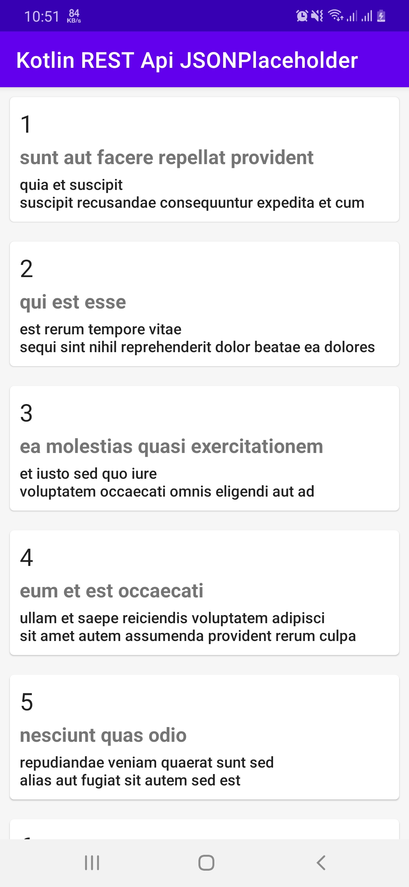
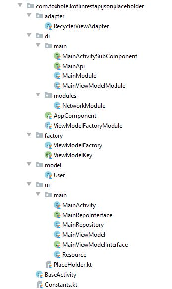

# Kotlin-REST-Api-JSONPlaceholder-RxJava-Dagger2-MVVM

Api : https://jsonplaceholder.typicode.com

## Used Component
-MVVM  
-AndroidX  
-ViewModel and LiveData  
-RXJava2  
-Retrofit2  
-Dagger 2  
-Used language Kotlin

## App overview 

## Project Structure 

